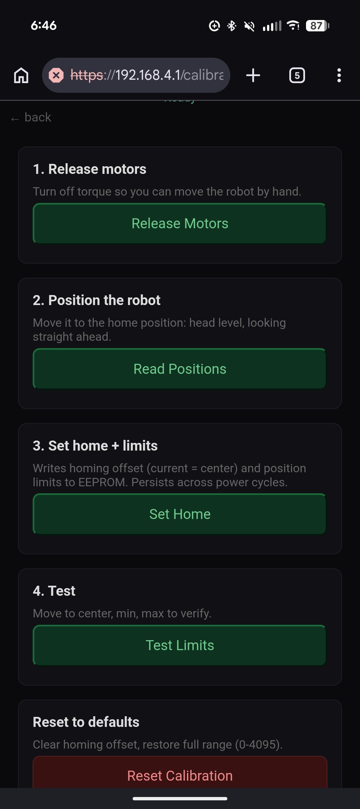

# TiltyBot Intro

## [TiltyBot Assembly & Advanced →](TiltyBot_Advanced_EN.md)

## What TiltyBot Is

TiltyBot is a small robot built from an ESP32-S3 microcontroller and two Dynamixel XL330 servo motors. It can be assembled as a mobile robot or a minimalist desktop robolt.

The robot runs its own Wi-Fi network and serves a phone browser-based control interface.

## How to Connect

1. On your phone, open Wi-Fi settings and look for a network starting with `BOT-` (e.g., `BOT-red`, `BOT-blue`)

2. Connect to it. The password is `12345678`. Your phone will say it can't provide internet. Turn of cellular data.

3. Open a browser and go to `https://192.168.4.1`

4. You will see a certificate warning. Tap **Advanced**, then **Proceed to 192.168.4.1 (unsafe)**. The robot uses a self-signed certificate so the browser can access phone sensors like the gyroscope.

5. You should see the TiltyBot main menu:

## Modes

### Drive

Differential drive control using an on-screen joystick. Click the checkbox to activate the motors, then touch and drag to steer.

### Tilty (Android only)

Controls the robot's pan and tilt using your phone's orientation. Hold your phone and tilt it — the robot follows.

> Gyro control requires an Android device. Manual sliders are available on any device as a fallback.

**Before using Tilty mode, calibrate the robot.**

Open the Calibrate page from the main menu:

1. Tap **Release Motors** — this turns off motor torque so you can move the head by hand
2. Physically position the robot's head to the desired neutral pose: level, facing straight ahead
3. Tap **Read Positions** to confirm the motor values
4. Tap **Set Home** — this writes the current position as the new center to motor memory
5. Tap **Test Limits** — the robot moves through its range so you can verify it looks correct

Calibration persists across power cycles. You only need to redo it if you physically reassemble the robot.

Once calibrated, open Tilty mode. Use the sliders for manual control:

Or enable the **Gyro** checkbox to control with phone orientation:

### 2-Motor

Direct slider control of both motors independently. Useful for testing motor response or exploring range of motion.

### Puppet (two bots)

One robot mirrors another's movements in real time. You move the controller robot by hand, and the puppet robot follows.

**Setup:**

1. Open the Puppet page on both robots (from two phones, each connected to its own bot's Wi-Fi)
2. Pick the **same emoji** on both robots

3. On one robot, tap **Controller** — its motors release so you can move it by hand
4. On the other robot, tap **Puppet** — it begins following the controller's movements
5. Tap **Stop** on either robot to end

For best results, calibrate both robots before using puppet mode.

### Sound

We provide a basic audio control interface for use with a small bluetooth speaker. You can do text-to-speech, a "robot" soundboard, audio recording, and file playback.

Sound mode is designed for a **second operator**. One person controls the robot's movement (via Drive, Tilty, or Puppet) while another person operates Sound mode from a second phone connected to the same robot.

The first time you open Sound, your browser will ask for microphone permission. Tap **Allow while visiting the site** if you want to use the recorder.

## If Something Doesn't Work

| Problem | Try |
|---|---|
| Can't find the Wi-Fi network | Make sure you're close to the robot and it's powered on |
| Page won't load | Confirm you're on the `BOT-*` network, go to `https://192.168.4.1` |
| Certificate error won't go away | Try a different browser (Chrome works best) |
| Motors don't respond | Reload the page, or try 2-Motor mode to check basic connectivity |
| Tilty gyro doesn't work | Confirm you're on an Android device. Toggle the Gyro checkbox off and on |
| Puppet doesn't follow | Check both robots selected the same emoji. Recalibrate both |
| Robot behaves strangely after reassembly | Recalibrate |