# TiltyBot Lab

## What is TiltyBot?

TiltyBot is a small expressive robot you control from your phone's browser. It has two servo motors and a microcontroller.


### Parts

- **ESP32-S3-Zero** — a small Wi-Fi microcontroller ([Waveshare](https://www.waveshare.com/esp32-s3-zero.htm))
- **2× Dynamixel XL330-M077-T** — smart servo motors ([Robotis](https://robotis.us/dynamixel-xl330-m077-t/))
- **Hinge frame** — connects the two motors in a pan/tilt configuration ([Robotis](https://en.robotis.com/shop_en/item.php?it_id=903-0302-000))
- **USB-C battery pack**
- **Whatever you build around it** — cardboard, tape, etc

### How it's connected

```
   ┌─────────┐  USB-C  ┌──────────┐ 3-wire  ┌──────────┐ 3-wire  ┌──────────┐
   │ Battery ├────────►│ ESP32-S3 ├────────►│ Motor 1  ├────────►│ Motor 2  │
   └─────────┘         └────┬─────┘  bus    │  (Tilt)  │   bus   │  (Pan)   │
                            ┆               └──────────┘         └──────────┘
                            ┆ Wi-Fi
                            ┆ HTTPS
                       ┌────┴─────┐
                       │  Phone   │
                       │ (Browser)│
                       └──────────┘
 ```

The motors daisy-chain together on a single 3-wire bus (power + ground + data). The ESP32 runs a Wi-Fi network and HTTPS server which your phone connects to directly.

### The motors

These are [Dynamixel XL330-M077-T](https://robotis.us/dynamixel-xl330-m077-t/) servos. They're assembled in a pan/tilt configuration. You can think of it as:

- A **head and neck** — nod and look around
- A **torso and legs** — lean and twist
- A **short stubby snake** — two joints that wiggle

You can decide what each motor corresponds to.

### Set up

We've assembled the hardware, flashed the firmware, and calibrated each robot. 

- Firmware: [`src/tiltybot/main.cpp`](src/tiltybot/main.cpp)
- Web UI: [`data/`](data/) (HTML/CSS/JS served from the ESP32's filesystem)
- Full build/flash instructions: [TiltyBot Assembly & Advanced](TiltyBot_Advanced_EN.md)

---

## 1. Connect to Your Robot

Your robot automatically starts running when you connect it to power, and it is already serving a webpage which enables the robot to be remotely controlled. Look for the WiFi network with the same label as your robot.
Connect to it from a phone (android works best!):

1. Open Wi-Fi settings, find your robot's network (starts with `BOT-` and matches the sticky note color)
2. Password: `12345678`
3. Turn off your phone's cellular network
4. Open `https://192.168.4.1` in your browser
5. Accept the certificate warning (tap Advanced → Proceed)
6. You should see the TiltyBot menu served up by your robot


<p>
  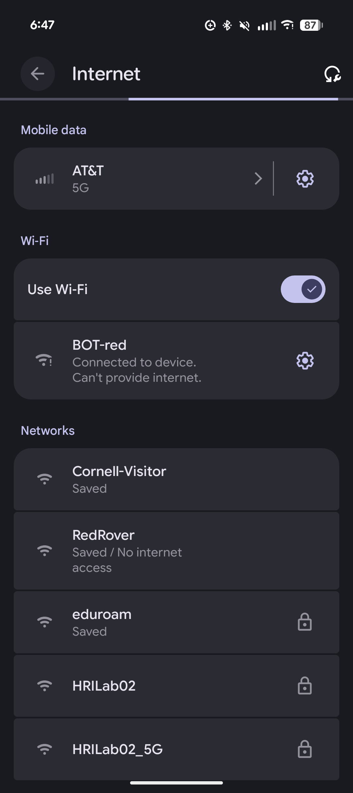
  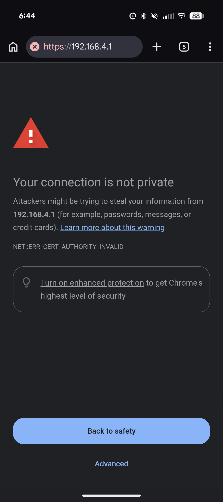
  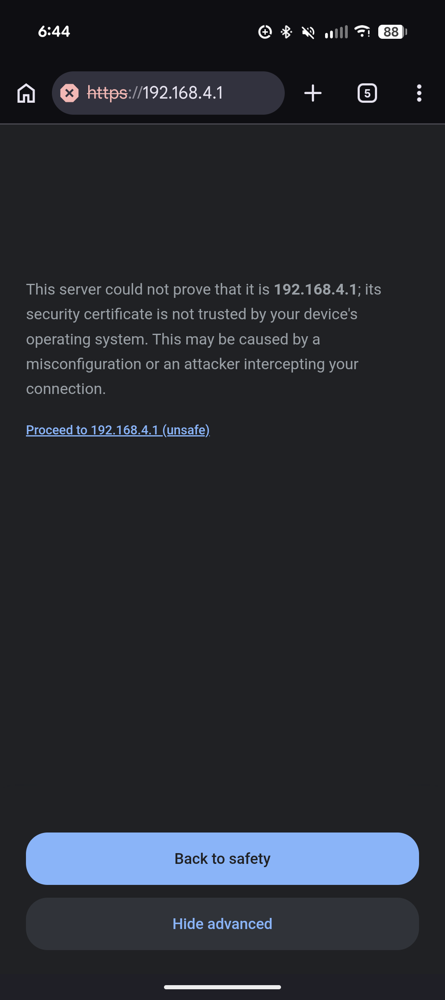
</p>

You should see the TiltyBot menu:

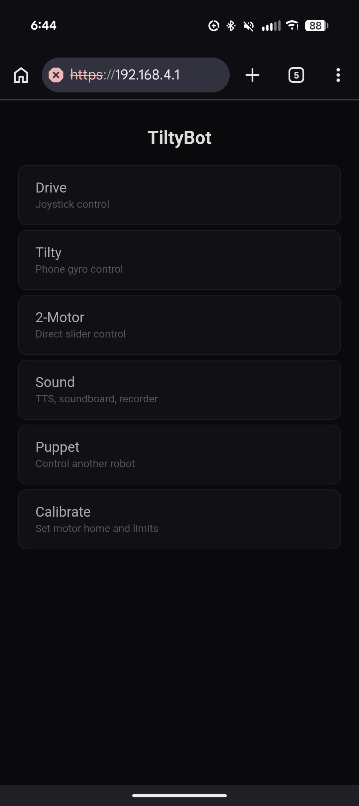


---

## 2. Explore Motion

Your robot has several control modes. How you wizard a robot can shape what kinds of affect it can express. Try each of them and see what interactions feel natural.

### 2A. Tilty

Open **Tilty** from the menu. Use the sliders to control tilt (up/down) and pan (left/right).

With an Android phone, enable the **Gyro** checkbox. Your phone's orientation now controls the robot directly. Tilt and angle your phone to wizard the robot.

<p>
  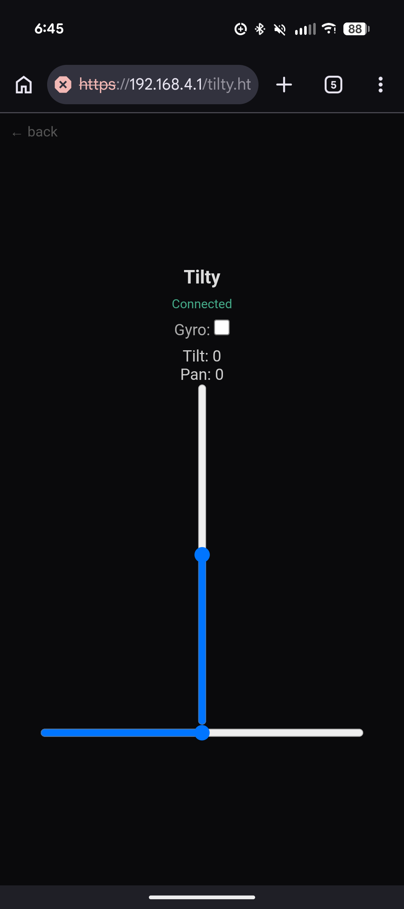
  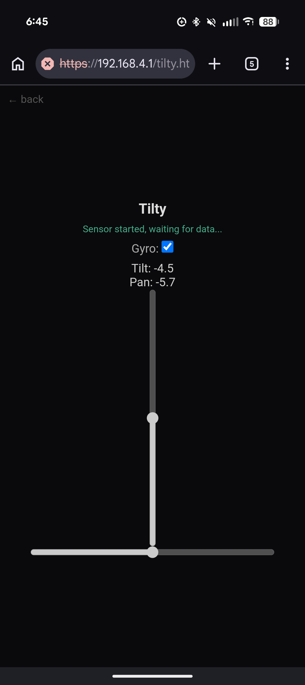
</p>


> **Under the hood:** Gyro mode uses [`RelativeOrientationSensor`](https://developer.mozilla.org/en-US/docs/Web/API/RelativeOrientationSensor) to get hardware quaternions from the phone's IMU, then decomposes a delta quaternion into YXZ Euler angles. This avoids gimbal lock. If you're curious the math is in `data/tilty.html`.

### 2B. 2-Motor

Open **2-Motor** from the menu. Two sliders, one per motor. This gives you a clear understanding what each motor can do physically.

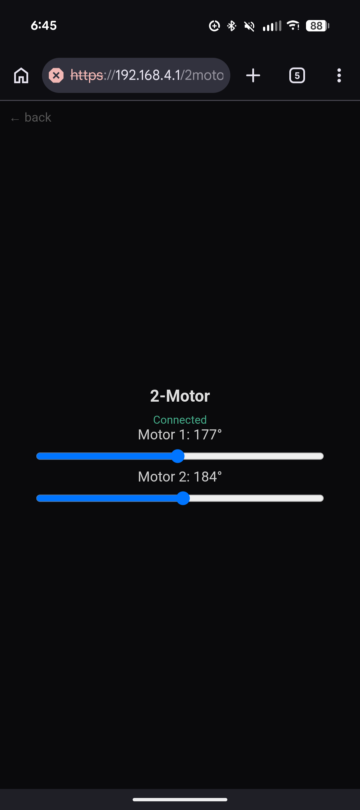

### 2C.  Drive

If you are more interested in a mobile robot than a desktop robot, we have pre-assembled motor pairs configured for driving. Take them, unplug your tiltybot from the esp32 and plug the wheels in instead. You will have to attach the motors to a piece of cardboard to act as a base.

Open **Drive** from the menu. Check the **Active** box, then use the joystick to drive. The robot uses differential drive — both motors spinning the same direction turns, opposite directions goes straight.


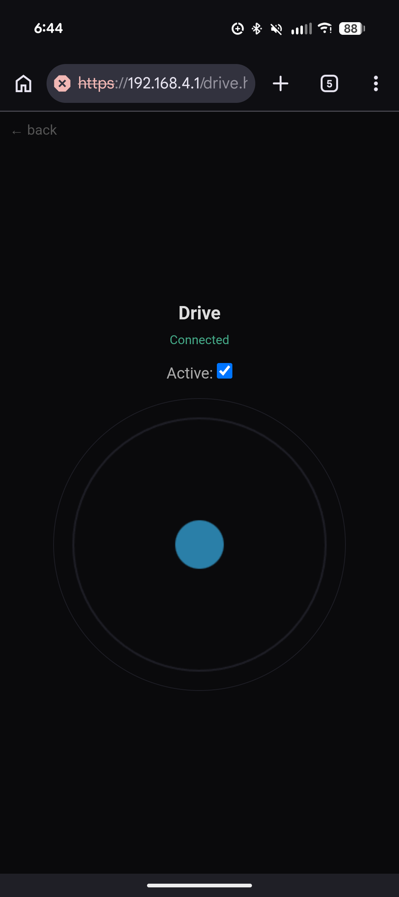


> **Under The Hood:**  A 300ms watchdog stops the motors if the client connection drops. Robots should ALWAYS use a watchdog timer.

### Questions

- How does each control mode change what the robot can express?
- What would you want the robot to do that you can't do yet?

---

## 3. Puppet Mode

Find another group. You'll pair two robots together. One will be the controller whicy you can direct by hand, the other will be a puppet and mirror its actions.

### Setup

1. On **both** robots, open the **Puppet** page
2. Pick the **same emoji** on both
3. One robot: tap **Controller** — its motors release, you move it by hand
4. Other robot: tap **Puppet** — it follows the controller's movements
5. Tap **Stop** on either robot when done

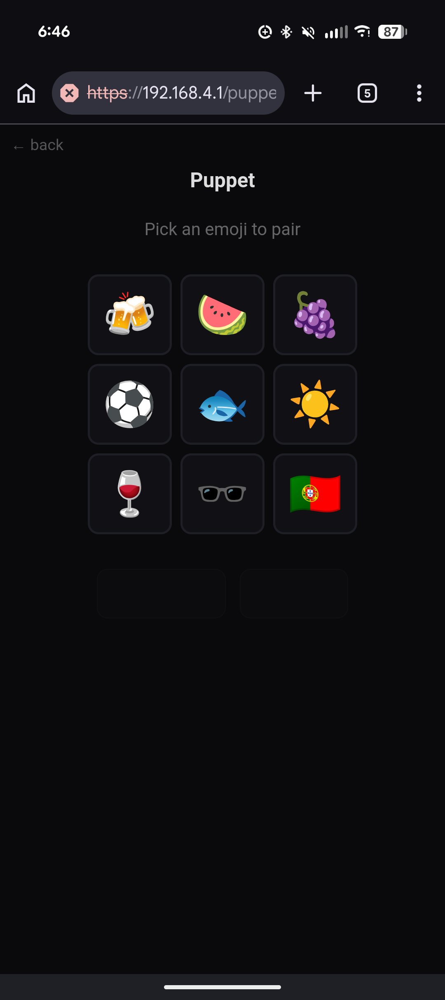

### Try it

- Have one person wizard the controller while someone from the other group interacts with the puppet
- Switch roles


> **Under The Hood:** Puppet mode uses ESP-NOW, a peer-to-peer wireless protocol that runs alongside Wi-Fi with ~1–5ms latency. The controller reads motor positions, converts to degrees, and broadcasts at ~100Hz. The puppet converts back using its own calibration. See the `PuppetPacket` struct in `main.cpp`. You can puppet multiple robots simultaneously. How would the interaction change with two, three, five, fivehundred tiltybots?

---

## 4. Sound

**When you get to this step ask Ilan for a speaker.**

Sound mode is designed for a **second operator**. One person controls the robot's movement (any mode), while another person triggers sounds from a second phone connected to the same robot.

### Setup

1. Connect a second phone to the same `BOT-*` network
2. Connect your phone's Bluetooth to the speaker. The speaker should show up as `MT`
3. Open **Sound** from the menu
4. Allow microphone access if prompted
5. Turn the speaker on and put it in pairing mode by holding the button on the bottom until the light flashes.
  

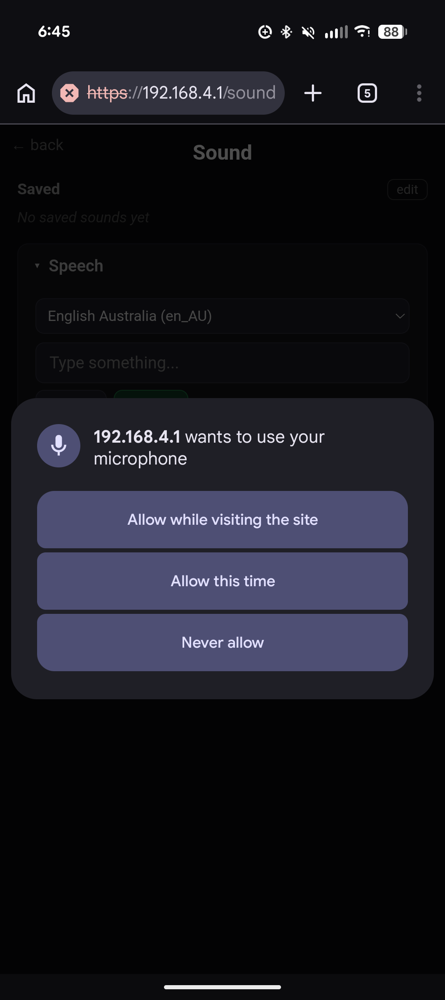

### What's available

- **Speech** — type text, pick a voice, tap Speak. Tap + Save to keep phrases for quick access.
- **Soundboard** — 24 synthesized robot sounds (beeps, chirps, affirmations, etc). Tap to play, tap + to save to the top bar.
- **Record** — record from the microphone or load audio files from your phone.

You can find sounds all over the internet. I am a fan of https://freesound.org/

Saved sounds appear in the **Saved** section at the top for one-tap playback during an interaction.

<p>
  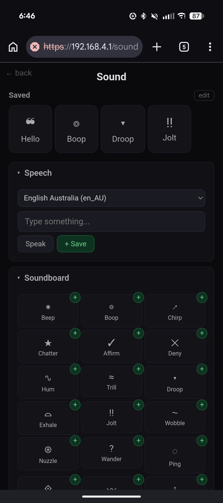
  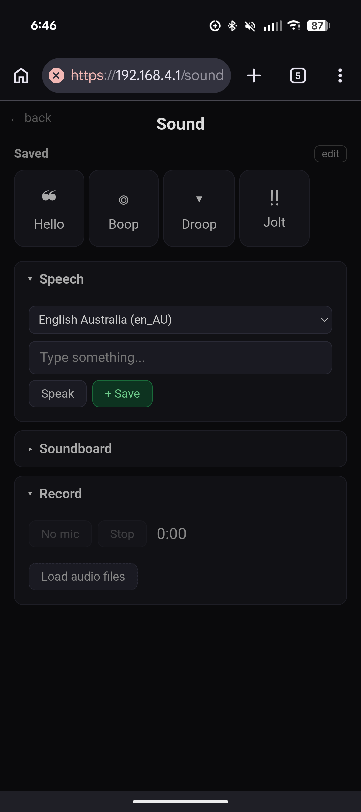
</p>

### Try it

- One person drives or puppets, the other does sound
- Practice synchronizing your actions. Plan out what motions and sounds should occur in tandem. Try doing improv with another member of your group. 
- Try an interaction with just motion, then just sound then try combining them.

### Questions
- When does sound help? When does it get in the way?
- How does operating two channels (motion + sound) change wizarding?

> **Under the hood:** TTS uses the browser's built-in [`SpeechSynthesis`](https://developer.mozilla.org/en-US/docs/Web/API/SpeechSynthesis) API. Soundboard effects are generated with the Web Audio API ([`OscillatorNode`](https://developer.mozilla.org/en-US/docs/Web/API/OscillatorNode), [`BiquadFilterNode`](https://developer.mozilla.org/en-US/docs/Web/API/BiquadFilterNode), etc). See `data/sound.html`.

---

## 5. Design an Interaction

Use what you've explored to design a short interaction.

How would a tiltybot take your order at a restuarant? How might it direct you to the right classroom in driving mode?


### Pick your setup

- Which control mode?
- Who is the robot interacting with? Someone from your group? A stranger?
- What is the context?
- What is the robot's role? 

### Design it

- What happens? Write down 2–3 sentences describing the interaction.
- What is the robot doing and why?
- What do you expect the person to do?

### Run it

- Try it at least once within your group
- Then try it with someone who wasn't involved in the design
- Did people respond the way you expected?
- What would you change?
- What did the control mode make easy or hard?

---

*— Coffee break —*

---

## 6. Check-in

Brief group share. What did you try? What didn't work?

---

## 7. Refine and Record

You have the rest of the afternoon to iterate on your interaction and capture it on video.

### Goals

- Refine your interaction based on what you learned
- Try it with people! 
- - Try a different setting (hallway, doorway, desk, open space)
- **Record video** — capture the full interaction, not just the robot. Include the person's reactions and the context.
- These can be naturalistic or acted. You want to clearly explore the *interaction*
- What research questions did these explorations inspire?
- You'll present these tomorrow


> If you're interested in automating interactions, modifing the control interfaces or extending tiltybot talk to Ilan about it!
